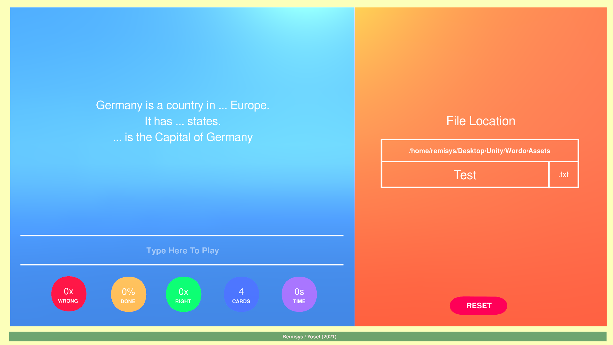
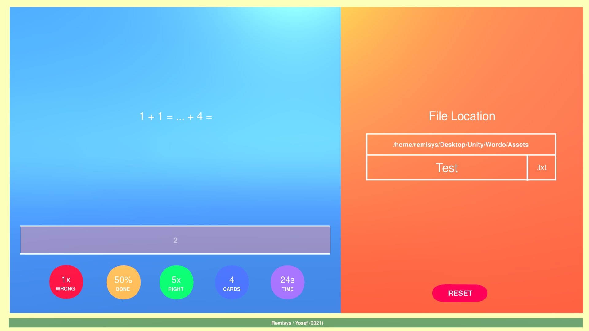
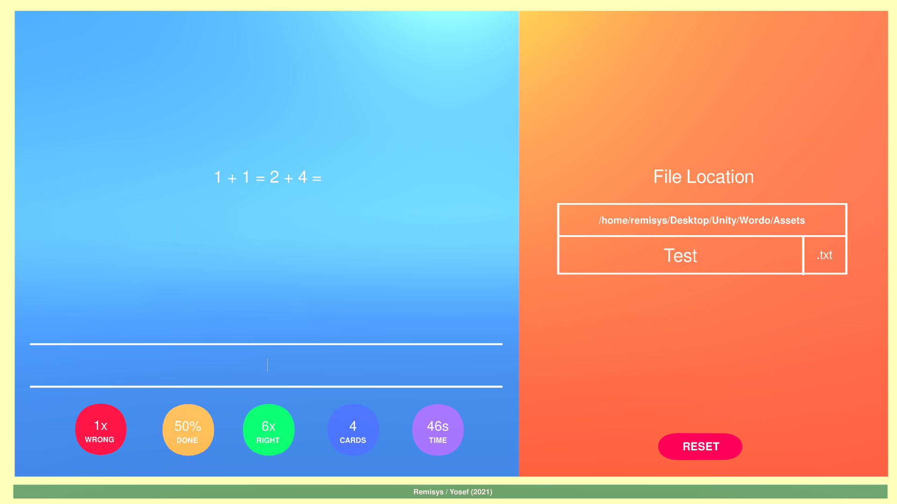

# Wordo 2021
It originally came from my other older project called Wordo which sadly went private
The remake is a simplified and cleaner remake of the original Wordo. Some features would be missing.

 **Wordo  : It is a project to make my own distinct flashcards app. The UI would be something different thanks to Unity Game Engine. It is now remaked to refresh my coding skills. Please do go through the documentation to make your own deck**
________________________________________________________________________________________________________________________________________
#### TO DO LIST TO RUN THE APPLICATION
* 1. Please clone the project. Please also have Unity Game Engine installed.
  
* 2. (Non Linux) Then do build the project and locate your file of choice in the application with the help of Unity Game Engine. It contains a Test.txt which could be analysed, modified, and/or tested directly for the app.

* 2. (Linux) By the time this project goes online. I should have also attached an executable file for Linux.
________________________________________________________________________________________________________________________________________
### Features

#### - NO DEADLINES OR NOTIFICATIONS :
   It functions more or less like a quiz

#### - DISTINGUISHABLE UI :
   The GUI is possible thanks to Unity Engine.

#### - MAKE YOUR OWN LEVELS WITH TEXTEDITOR :
   Just create a simple text file and follow the rules to make your own card deck

#### - STATISTICS MADE AVAILABLE TO USERS :
   It shows you how you have performed while you are going through your deck through memorization

#### - FILL IN THE BLANK FEATURE
  The card could function just like going through a fill in the blank task at the test


________________________________________________________________________________________________________________________________________
### SCREENSHOTS
 </img>
 </img>
 </img>
________________________________________________________________________________________________________________________________________


### DOCUMENTATION (A DIY Guide)

## 3 : HOW TO MAKE YOUR OWN CARD DECK (DIY)
Note : Please read the instructions precisely and thorougly.

#### Step 1 : Write down this keyword "CARD" at your preferred line and please do not add anything else to that line
Function : Signaling the file reader that you are creating a card
```
CARD
```

#### Step 2 : Write down your Question beneath the keyword "CARD"
```
CARD
10 + 3 = ...
10 - 3 = ...
```

#### Step 3 : After finishing writing your text, please write the keyword "<A>" underneath your text
Function : It signals the file reader to save down anything below this keyword as an answer
```
CARD
10 + 3 = ...
10 - 3 = ...
<A>
```
#### Step 4 : Write down your answers. If the card is like a paragraph full of to be filled blank places, please use a comma to seperate it
Note : After the comma, there is no space <br />
Function : It signals the file reader that there are multipled answers that should be filled in the blanks in the exact given order <br />
Option : In the text section you could add this keyword "..." which could then be replaced by the program if the user enters the correct answer
```
CARD
10 + 3 = ...
10 - 3 = ...
<A>
13,7
```
#### Step 5 : End it in the brand new line underneath all of what you have just written with this keyword "</A>"
Note : It signalize the file reader to initialize a card object to be saved as a list.
```
CARD
10 + 3 = ...
10 - 3 = ...
<A>
13,7
</A>
```
#### Step 6 : Congratulations. You have just made one new card. Please make as many cards as you like and save it as a file. Remember where you have saved it, so you could locate the file in the application
________________________________________________________________________________________________________________________________________
#### This is how a full file for testing purposes (Test.txt) looks like. You could also find it at the assets folder
```
CARD
Germany is a country in ... Europe.
It has ... states.
... is the Capital of Germany
<A>
Central,16,Berlin
</A>

CARD
German Translation of The House would be ... ...
<A>
Das,Haus
</A>

CARD
1 + 1 = ... + 4 =
<A>
2,6
</A>

CARD
Is Germany as of 2021 in the EU? (ja/nein)
<A>
ja
</A>
```

________________________________________________________________________________________________________________________________________
### GOAL   
I am currently a 3rd Semester Computer Science Bachelor Student at Leibniz University Hannover. It should act as a portfolio to help enrich my experience and maybe to win a scholarship in Germany.
________________________________________________________________________________________________________________________________________
### FINALLY :

Thank you to Unity Game Engine for making this come true. Thank you for anyone taking a peek at this github page.
